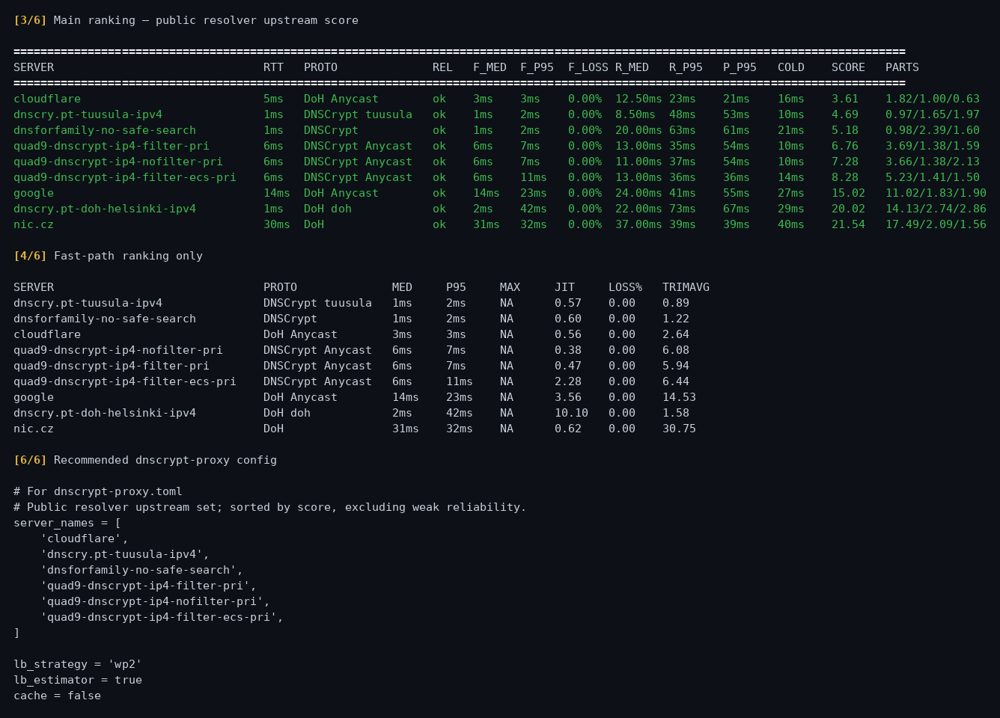

# DNS Resolver Benchmark for dnscrypt-proxy

[](https://github.com/Ozy-666/dns-ultra/releases/latest)
[](https://www.gnu.org/software/bash/)
[](https://github.com/DNSCrypt/dnscrypt-proxy)

**Find the fastest, most reliable upstream DNS resolvers for your dnscrypt-proxy setup — automatically.**

`dns-ultra` is an advanced Bash script designed to benchmark hundreds of public DNS resolvers and pinpoint exactly which ones are worth using as upstreams for your privacy-focused network setup. Instead of relying on raw, simplistic ping tests, it runs real-world application queries, accurately measures metrics that matter for day-to-day use, and outputs a ready-to-paste, optimized configuration block. No guessing, no manual testing.

<p align="center">
  
</p>

---

## What does it do?

In short: it dynamically fires up separate, isolated `dnscrypt-proxy` instances for each candidate resolver, executes a highly structured set of live DNS queries, evaluates real-time latency and reliability, scores the performance, and prints a beautifully ranked table along with a tailored configuration block at the end.

The script thoroughly tests four dimensions per resolver:
* **Fast-path** — Evaluates response times for highly popular, steady-state domains (e.g., `google.com`, `github.com`, `cloudflare.com`). This simulates the warm-cache hits your users actually experience every day.
* **Recursion** — Probes brand-new, uncached domains to measure the worst-case lookup time and authoritative chain walk latency.
* **Burst** — Tests concurrency tolerance under a rapid series of back-to-back queries (both sequential and parallel execution) to detect silent rate-limiting.
* **Cold-start** — Measures the absolute connection setup time from a fresh process initialization to the first working cryptographic handshake answer.

The final score is heavily weighted toward the **fast-path and consistency**, optimizing performance specifically for architectures with a local caching tier (like Unbound or AdGuardHome) sitting in front of `dnscrypt-proxy`.

### Which domains get queried, and why it matters

Every test domain is served by a hyperscale or CDN anycast DNS platform — Cloudflare, Google, AWS, Meta, NS1, Azure, Akamai, Fastly, Automattic — and the list is spread across those providers so a score is never just a measure of one provider's cache.

That is a deliberate constraint, for two reasons:

* **Load.** A benchmark should not aim repeated traffic at small or volunteer-run operators. This matters most for the Recursion and Burst profiles, which query random subdomains that can never be cached, so every single one reaches the authoritative servers.
* **Accuracy.** A domain whose own nameservers are slow poisons the measurement the moment a query misses cache. Measured from a European VPS, straight to the authoritative NS: `iana.org` answers in ~110 ms and `wikipedia.org` in ~150 ms, against ~0–10 ms for the operators above. One such miss drops a >100 ms outlier into a sample set whose real values are single-digit milliseconds — and with a small round count, that outlier *becomes* the p95. Before v8.4.0 this was skewing real rankings; see the changelog.

Fast-path domains are warmed before measurement so they are genuine cache hits. Recursion deliberately does the opposite.

---

## Why this exists

Most DNS benchmark tools make a fundamental methodological mistake: they mix cached and uncached lookups into a single mathematical average, ranking servers based on that unrepresentative median. This approach breaks results badly. A few slow, recursive authoritative walks (such as resolving a random subdomain of `kernel.org` for the first time) can heavily skew metrics, making a reliable, high-performance anycast network like Cloudflare or Quad9 look worse than a sketchy local VPS resolver that simply got lucky on a packet sample.

`dns-ultra` was specifically engineered to eliminate this flaw. It was created after watching premium anycast providers consistently lose rankings in standard testing suites despite years of proven real-world reliability. The root cause was always bad testing methodology — not bad infrastructure performance.

### What makes this different:
* **True Separation:** Distinctly separates cached fast-path queries from uncached recursive lookups — applying specialized scoring rules to each.
* **Cache-Aware Weighting:** Allocates only a 25% weight to recursion latency, recognizing that your local cache layers absorb the vast majority of everyday misses.
* **Jitter-Dominant Scoring:** Prioritizes latency consistency over absolute peak speed. A stable resolver that always answers in 8ms easily beats a erratic node alternating between 3ms and 40ms.
* **Ethical Query Pacing:** Applies intelligent packet pacing (15ms for DoH, 50–150ms randomized windows for DNSCrypt) to guarantee the benchmark doesn't accidentally trigger security rate-limits or yield false failures.
* **Protocol Auto-Detection:** Dynamically senses whether a server target utilizes DoH (DNS over HTTPS) or DNSCrypt, automatically adjusting underlying test parameters.
* **Baseline Pinning:** Explicitly locks known-good public operators (Cloudflare, Google, Quad9 DNSCrypt) so they always appear in final tables as an objective reference, even if local routing anomalies kept them out of top-N speed categories.
* **Smart Filtering:** Permanently filters out problematic transport layouts, such as Quad9 DoH nodes (see analysis below), protecting your upstream configuration from unstable routing paths.

---

## Target stack

```text
Your device ──> AdGuardHome ──> Unbound (cache) ──> dnscrypt-proxy ──> upstream resolver
```

* If your setup includes an active caching layer before `dnscrypt-proxy`, the **fast-path score** is your critical metric. Unbound handles standard caching, meaning your upstream servers are only touched for intermittent cache refreshes.
* If you run `dnscrypt-proxy` directly as your single endpoint resolver without an external cache above it, simply export `DNSCRYPT_CACHE=true` when running the tool. The overall score logic holds true, though recursion tail-latency will carry more direct importance for your local clients.

---

## Quick Start

### Requirements
* **Linux or macOS** with Bash 4+ installed.
* **`dnscrypt-proxy`** v2.1.0 or newer (automatically discovered by the script).
* Standard core utilities available in your environment: `dig`, `awk`, `sed`, `grep`, `sort`, `xargs`, `openssl`, `jq`.

On Ubuntu/Debian, ensure your toolset is fully updated by running:
```bash
sudo apt install dnsutils openssl jq
```

### Install and run

```bash
# Clone the repository and enter the directory
git clone https://github.com/Ozy-666/dns-ultra.git
cd dns-ultra

# Make the benchmark executable
chmod +x dns-ultra.sh

# Run the complete rigorous benchmark (~12–15 minutes)
./dns-ultra.sh

# Or execute a high-speed profile run (~3–5 minutes, optimized candidate list)
./dns-ultra.sh --quick

# Profile 4 servers at a time (default) — cuts Phase 2 time roughly in half
./dns-ultra.sh --parallel

# Customize concurrency level — useful on faster machines or larger candidate sets
./dns-ultra.sh --parallel 6

# Combine both for the fastest possible run (~1–2 minutes)
./dns-ultra.sh --quick --parallel

# Combine with a custom concurrency level
./dns-ultra.sh --quick --parallel 6
./dns-ultra.sh --parallel 8
```

### Where is dnscrypt-proxy?
The script handles binary hunting completely automatically. It searches your system `$PATH`, scans standard paths like `/opt/dnscrypt-proxy/` or `/usr/local/bin/`, and checks common portable deployment archives. If you use a non-standard manual path, pass it explicitly as an environment flag:

```bash
PROXY_BIN=/your/custom/path/to/dnscrypt-proxy ./dns-ultra.sh
```

---

## What you get at the end

After completing a benchmark run, the script outputs several layers of data analysis:
1. **A ranked master table** of all discovered and profiled resolvers, organized cleanly by total performance score.
2. **A fast-path-only lookup ranking** isolating the top 10 positions for pure cached query speed.
3. **A tail offender breakdown** revealing exactly which query domains caused severe P95 latency lag spikes.
4. **A ready-to-paste `dnscrypt-proxy` config block** populated with your localized top-tier reliable upstreams.
5. **Two structured JSON files** containing complete diagnostic metrics for customized analysis or tracking:
   * `dns-benchmark-results-v8.json` — Comprehensive individual scores and statistics per server.
   * `dns-benchmark-domain-tails-v8.json` — Granular per-domain resolution performance tracking.

The final console interface uses color-coded evaluation nodes: Servers marked `ok` are rock solid. `watch` flags minor packet loss trends. `weak` signals systemic reliability degradation — these nodes are strictly stripped from your automated config recommendations.

---

## Configuration

All advanced profiling flags are handled cleanly via environment variables. Sane, safe defaults are pre-configured for normal system hardware. The `--quick` flag acts as an integrated runtime macro to drop candidate counts and round cycles for rapid network testing.

| Variable | Default | `--quick` | What it does |
| :--- | :--- | :--- | :--- |
| `PROXY_BIN` | `auto-detect` | — | Explicit filesystem path to your target `dnscrypt-proxy` binary |
| `TOP_PHASE2` | `24` | `6` | Number of fast initial-RTT servers moved to deep structural profiling |
| `FASTPATH_ROUNDS` | `5` | `3` | Query sequence iteration loops performed per warm fast-path domain |
| `RECURSION_ROUNDS` | `6` | `2` | Query sequence iteration loops performed per uncached recursion target |
| `SEQ_BURST_QUERIES` | `35` | `10` | Volume of consecutive, rapid sequential burst packets sent to target |
| `PAR_BURST_QUERIES` | `30` | `10` | Volume of highly concurrent parallel burst packets sent to target |
| `COLDSTART_SAMPLES` | `3` | `1` | Number of distinct process-restart connection latencies measured |
| `TIMEOUT` | `120` | `30` | Maximum operational execution seconds allocated for the initial discovery phase |
| `LISTEN_IP` | `127.0.0.1` | — | Dedicated local loopback IP interface for binding spawned proxy instances |
| `BASE_PORT` | `55000` | — | Base tracking port allocation floor for assigning testing proxy sockets |
| `PAR_PROFILE_JOBS` | `4` | — | Number of servers profiled simultaneously when `--parallel` is used |
| `DNSCRYPT_CACHE` | `false` | — | Activates internal proxy caching logic (Enable only if no upstream Unbound is present) |

---

## How the score works

**Lower absolute score = higher quality, more stable resolver.**

The script models real-world operational health through a specialized multi-variable equation:

```text
fast-path  = (median × 0.30) + (P95 × 0.25) + (jitter × 0.30) + (loss%² × 3)
recursion  = ((median × 0.10) + (P95 × 0.12) + (loss% × 10)) × 0.25
burst      = (sequential P95 × 0.030) + (parallel P95 × 0.010)
cold-start = min(cold_ms, 100) × 0.01

total score = fast-path + recursion + burst + cold-start
```

### Core Logic Behind the Weights:
* **Jitter Matches Median (0.30 weight):** A stable resolver delivering steady 8ms responses will score higher than an unstable node wildly jumping between 4ms and 40ms. Low jitter is a primary signal for fluid browsing.
* **Packet Loss Penalized Exponentially (squared factor):** Minor network noise is easily tolerated, but persistent drops indicate system stress. A 1% packet loss adds ~3 points to the score; a 5% loss drops a heavy 75-point penalty, immediately sinking the resolver's rank.
* **Recursion De-emphasized (0.25 multiplier):** Because local system caching layers process the overwhelming majority of redundant queries, uncached lookup latency acts strictly as an architectural tiebreaker rather than a dominant sorting metric.
* **Capped Cold-Start Thresholds (100ms max):** Enforced cryptographic handshakes or remote certificate lookups can cause a safe DNSCrypt node to experience an occasional 999ms connection spike on boot. The mathematical cap ensures an ephemeral startup lag cannot break a server's long-term steady-state ranking.

---

## DoH vs DNSCrypt — what the benchmark discovered

Extensive production testing from a headless VPS infrastructure node in Finland exposed profound behavioral deltas between different cryptographic transport protocols operating over the exact same anycast destination networks.

| Server | Protocol | Packet loss | Median | P95 |
| :--- | :--- | :--- | :--- | :--- |
| `quad9-dnscrypt-ip4-nofilter-pri` | DNSCrypt | **0.00%** (0/1200) | 6 ms | 7 ms |
| `quad9-doh-ip4-port443-nofilter-pri` | DoH | **1.83%** (22/1200) | 6 ms | 7 ms |
| `cloudflare` | DoH | **0.00%** | 2 ms | 4 ms |

Re-measured 2026-08-01: 1200 sequential queries per protocol, same host, same
link, run back to back. The Quad9 DoH loss rate has improved substantially from
the 4–6% first recorded, but it has not reached zero, and the DNSCrypt endpoints
on the same network still lose nothing at all.

Note that **latency is identical** between the two Quad9 transports — 6 ms
median, 7 ms p95 for both. This is purely a delivery-reliability difference, not
a speed one. Quad9 is a fast resolver on either transport.

Notice the critical variance: The underlying network route, source host, and data target infrastructure remain perfectly identical. The singular variable modified is transport protocol.

### Why does Quad9 DoH drop packets while Cloudflare DoH stays stable?
* **DoH (DNS over HTTPS)** maps connections inside persistent, stateful TLS/HTTPS communication channels. Quad9's edge load-balancers monitor concurrent query limits per active socket session, aggressively resetting or dropping channels when software thresholds are crossed during high-speed parallel bursts. When an endpoint is forcibly dropped, standard clients quietly issue connection retries. While unnoticeable to a manual web browser user, a production caching tier like Unbound catches this as a severe packet drop, registering massive latency timeouts. Conversely, Cloudflare's massive infrastructure fabric scales smoothly without triggering similar socket-level connection blocks.
* **DNSCrypt** processes transactions via completely independent, stateless encrypted UDP structures. There are no long-lived underlying connection sessions to log, monitor, or throttle. As a direct result, Quad9's active edge defenses are never tripped, allowing their core platform to process massive query loads with a **perfect 0.00% drop rate**.

### What this means for your network:
Running Quad9 over DNSCrypt delivers premium end-to-end privacy, native DNSSEC validation, and a flawless 0% drop rate. Forcing the same traffic over DoH currently costs roughly 1 dropped query in every 55 (1.83%, re-measured 2026-08-01; it was nearer 1 in 20 when first tested). Since both transports answer equally fast, there is no speed argument for accepting that loss.

### Why Quad9 DoH is permanently excluded
To safeguard your target systems, the automated discovery process explicitly filters out all string targets matching `quad9-doh-*`. This structural blocker ensures an ephemeral fast anycast ping during initial discovery cannot accidentally slip an unstable, rate-limited DoH endpoint into your production routing configuration.

---

## A note on DNSSEC-strict resolvers

Engineered anycast platforms like Quad9 execute absolute cryptographic DNSSEC verification loops on every request pass. While an exceptional security architecture feature, processing complex NXDOMAIN structural lookups naturally introduces minor overhead, reflecting higher P95 scores inside the raw recursion matrix. 

This behavior is completely normal and represents active, protective validation logic rather than systemic node degradation. The script's 0.25 recursion scaling multiplier balances this beautifully, keeping security-hardened upstreams properly positioned without unfair scoring penalties.

---

## Recommended config format

Upon completing an execution run, `dns-ultra` automatically builds and prints a completely optimized configuration block, ready to insert directly into your local `/etc/dnscrypt-proxy/dnscrypt-proxy.toml`:

```toml
server_names = [
    'cloudflare',
    'quad9-dnscrypt-ip4-nofilter-pri',
    'cs-swe',
    'cs-norway',
    'dnscry.pt-stockholm-ipv4',
]
lb_strategy = 'wp2'
lb_estimator = true
cache = false
```

The designation `lb_strategy = 'wp2'` (Weighted Power-of-Two) represents the absolute gold standard for modern `dnscrypt-proxy` builds (v2.1.5+). It monitors upstream performance, dynamically extracts two target nodes from your pool, and shifts active packets onto whichever resource handles traffic faster at that precise millisecond. This prevents your network from bottlenecking on a single provider while keeping your overall latency floor exceptionally flat.

---

## Methodology limitations (honest)

* **One run = one data point:** Real-world wide-area routing is dynamic. Run this tool a few times across distinct time blocks (such as peak working windows vs off-peak hours) before locking in long-term infrastructure decisions.
* **Strict geographic bias:** All diagnostic metrics reflect the physical location of your VPS node or network drop. A premium node running at 5ms relative to your infrastructure host might register at 200ms for clients connecting from another region.
* **Sequential tracking on DoH bursts:** To prevent the testing engine from triggering infrastructure rate-limits on remote hosts, DoH nodes transition onto sequential burst loops rather than concurrent tracking. The resulting burst data reflects steady, continuous application delivery rather than theoretical maximum packet processing.
* **Approximated Cold-Start tracking:** Measurement loops start immediately after `dnscrypt-proxy` fires its primary process availability signal. Certain private anycast configurations run out-of-band warming optimizations that might not register inside standard application system logs.
* **Direct loopback focus:** The engine targets `dnscrypt-proxy -> upstream` performance exclusively. It intentionally bypasses the internal software overhead of AdGuardHome or Unbound. The collected metrics represent the *pure raw input quality* of your external uplink feed.

---

## Contributing

Community enhancements, bug reports, and optimizations are welcome. Core development focus areas include:
* Validated public pinned resolvers that serve as valuable global speed baselines.
* Structural pattern enhancements for geo-location routing identification engines (current logic relies on heuristics).
* Refined operational convergence tracking metrics within initial Phase 1 discovery loops.
* Compatibility profiles for native execution across specialized macOS and BSD environments.

---

## 🤖 Development Process

This project follows a human-driven architecture approach with AI-assisted implementation. I do not write native code; I engineer the systems, the logic, and the validation methodology.

The production syntax, scoring weights, and edge-case handling were refined through iterative collaboration with multiple AI models:
* **Anthropic Claude (Opus 5, Opus 4.7 / Sonnet 4.6)** — primary architect for methodology fixes, code review, and statistical reasoning. Opus 5 did the v8.4.0 field test: root-caused the warm-up gap, measured authoritative latency and Quad9 packet loss, and re-verified the exclusions against fresh data.
* **Google Gemini** — secondary review and refactoring assistance.
* **OpenAI ChatGPT / Codex** — early prototyping and bash idiom checks.

The AI models acted as high-level tools to translate years of operational DNS resolver experience into clean, conformant Bash. All design decisions, methodology choices, and the v7 → v8 honesty correction were human-led.

If you find a bug, the responsibility is mine. If you find a clean idiom, credit the swarm.

---

## License

© 2026 Ozy-666 (<https://dnsdoh.art>), released under the **MIT License** — see
[`LICENSE`](LICENSE) for the full terms.

No third-party code is bundled here. The public resolver database is fetched from
[DNSCrypt/dnscrypt-resolvers](https://github.com/DNSCrypt/dnscrypt-resolvers) when the
script runs, rather than vendored into this repository.

---

## Acknowledgements

* **[DNSCrypt Proxy](https://github.com/DNSCrypt/dnscrypt-proxy)** — For the exceptional underlying engine code and maintaining the open public resolver database.
* **Authoritative DNS Operators** (Cloudflare, Google, Amazon, Microsoft, Wikimedia) — For seamlessly routing our recursive diagnostic tracking queries without operational complaints.
